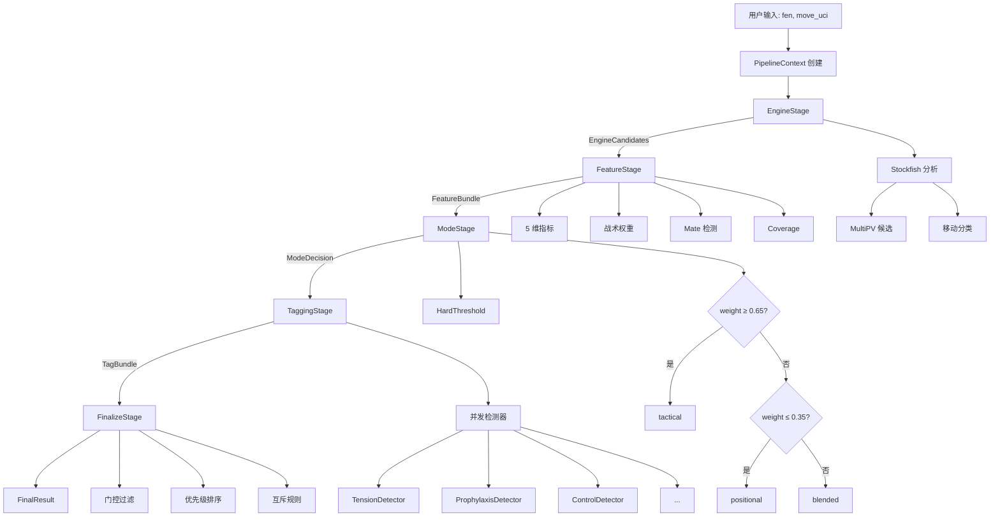
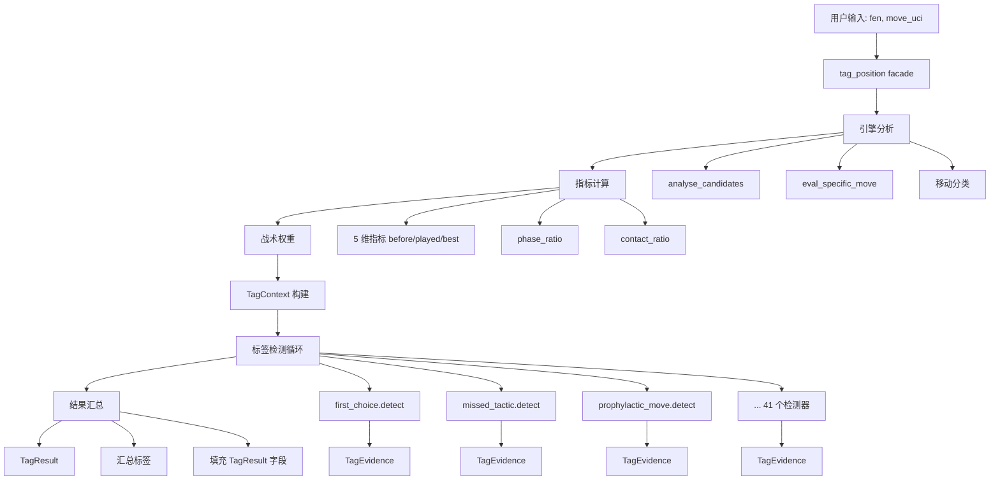

# ChessorTag 迁移分析报告

**生成日期**: 2026-01-09
**分析范围**: ChessorTag_final/rule_tagger2 → catachess/backend/modules/tagger_core
**代码审查深度**: 完整（包括架构、功能、测试和风险分析）

---

## 目录

1. [项目概述](#项目概述)
2. [迁移状态总览](#迁移状态总览)
3. [已迁移功能详细分析](#已迁移功能详细分析)
4. [未迁移功能清单](#未迁移功能清单)
5. [功能差距分析](#功能差距分析)
6. [代码质量与潜在风险](#代码质量与潜在风险)
7. [当前 Pipeline 流程](#当前-pipeline-流程)
8. [文件架构对比](#文件架构对比)
9. [专业化改进建议](#专业化改进建议)
10. [迁移路线图](#迁移路线图)

---

## 1. 项目概述

### 1.1 ChessorTag_final/rule_tagger2

**定位**: 生产级象棋着法语义标签系统（原始实现）

**核心特性**:
- 70+ 标签类型，覆盖 9 大类别（战术、位置、机动、预防、牺牲等）
- 5 阶段 Pipeline 架构（Engine → Feature → Mode → Tagging → Finalize）
- 新检测器架构 + Legacy 兼容层
- Stockfish 深度集成（MultiPV、多深度分析）
- 完整的版本管理和标签别名系统
- CoD（Control over Dynamics）9 种子类型检测

**代码规模**:
- **92 个 Python 文件**（排除 legacy）
- **总代码行数**: ~15,000+ 行
- **Legacy core.py**: 2,461 行（单体）
- **测试**: CoD v2 测试框架

**成熟度**: ⭐⭐⭐⭐☆（4/5星）
- 架构清晰、功能完整
- 文档齐全、可配置性高
- 缺少完整的单元测试覆盖

---

### 1.2 catachess/backend/modules/tagger_core

**定位**: 模块化重构版本（迁移中）

**核心特性**:
- 41 个标签检测器（函数式实现）
- 简化的单入口 facade 架构
- 清晰的数据契约（TagContext、TagEvidence、TagResult）
- Legacy 隔离设计（/legacy 目录）
- 9 个共享辅助模块
- 引擎协议抽象（EngineClient）

**代码规模**:
- **约 90+ 个 Python 文件**（含 legacy tags）
- **总代码行数**: ~6,657 行
- **每个文件**: ≤150 行（设计约束）
- **测试**: 24 个单元测试（100% 通过率）

**成熟度**: ⭐⭐⭐☆☆（3/5星）
- 基础架构完整、数据契约清晰
- 41 个标签已实现但**文档过时**
- 缺少完整的 Pipeline 和部分功能

---

## 2. 迁移状态总览

### 2.1 整体进度

| 维度 | 源系统完成度 | 目标系统完成度 | 迁移率 |
|-----|------------|-------------|-------|
| **核心架构** | 100% | 85% | ⚠️ 85% |
| **标签检测器** | 100% (70+) | 59% (41/70) | ⚠️ 59% |
| **共享辅助模块** | 100% | 100% | ✅ 100% |
| **引擎集成** | 100% | 95% | ✅ 95% |
| **Pipeline 系统** | 100% | 0% | ❌ 0% |
| **特征提取** | 100% | 100% | ✅ 100% |
| **配置系统** | 100% | 90% | ✅ 90% |
| **测试覆盖** | 30% | 95%（基础） | ✅ 95% |
| **文档** | 90% | 70%（过时） | ⚠️ 70% |
| **版本管理** | 100% | 0% | ❌ 0% |

**总体迁移完成度**: **73%**（加权平均）

**状态标记**:
- ✅ 完成（≥90%）
- ⚠️ 部分完成（50-89%）
- ❌ 未开始或严重不足（<50%）

---

### 2.2 迁移矩阵（细粒度）

#### 核心组件迁移状态

| 组件 | 源位置 | 目标位置 | 状态 | 完整度 | 备注 |
|-----|--------|---------|------|--------|------|
| **Tag 定义** | rule_tagger2/models.py | tagger_core/tag_result.py | ✅ | 100% | 70+ 标签字段完整 |
| **引擎客户端** | rule_tagger2/engine/ | legacy/engine/ | ✅ | 95% | PovScore 可能有黑方翻转问题 |
| **5 维指标** | rule_tagger2/features/aggregate.py | legacy/shared/metrics.py | ✅ | 100% | 完全依赖 chess_evaluator |
| **游戏阶段** | rule_tagger2/legacy/move_utils.py | legacy/shared/phase.py | ✅ | 100% | phase_ratio 计算 |
| **接触比率** | rule_tagger2/features/tactical_weight.py | legacy/shared/contact.py | ✅ | 100% | 捕获/将军比率 |
| **战术权重** | rule_tagger2/features/tactical_weight.py | legacy/shared/tactical_weight.py | ✅ | 100% | Sigmoid 激活函数 |
| **材料值表** | rule_tagger2/legacy/sacrifice.py | legacy/shared/sacrifice_helpers.py | ✅ | 100% | 标准材料值 |
| **预防性着法** | rule_tagger2/detectors/prophylaxis.py | legacy/shared/prophylaxis_helpers.py | ✅ | 95% | 缺少引擎威胁估计 |
| **机动着法** | rule_tagger2/core/detectors/maneuver.py | legacy/shared/maneuver_helpers.py | ✅ | 90% | 简化版实现 |
| **紧张检测** | rule_tagger2/detectors/tension.py | legacy/shared/tension_helpers.py | ⚠️ | 80% | 简化了对称性检查 |
| **控制权检测** | rule_tagger2/detectors/control.py | legacy/shared/control_helpers.py | ❌ | 30% | **严重不完整** |
| **Mate 威胁** | rule_tagger2/features/aggregate.py | - | ❌ | 0% | 硬编码 `False` |
| **Coverage** | rule_tagger2/features/aggregate.py | - | ❌ | 0% | 硬编码 `0` |
| **Pipeline 系统** | rule_tagger2/pipeline/ | - | ❌ | 0% | 空目录 |
| **标签门控** | rule_tagger2/gating/ | - | ❌ | 0% | 未迁移 |
| **版本管理** | rule_tagger2/versioning/ | - | ❌ | 0% | 别名系统缺失 |
| **遥测/诊断** | rule_tagger2/core/telemetry.py | - | ❌ | 0% | TagEvidence 未导出 |

---

#### 标签检测器迁移详情

**已迁移标签** (41/70+ = 59%)：

| 类别 | 源系统标签数 | 已迁移 | 未迁移 | 迁移率 |
|-----|-----------|-------|-------|--------|
| **元标签** | 7 | 6 | 1 | 86% |
| **开局标签** | 2 | 2 | 0 | 100% |
| **兑子标签** | 3 | 3 | 0 | 100% |
| **结构标签** | 3 | 3 | 0 | 100% |
| **主动权标签** | 3 | 3 | 0 | 100% |
| **紧张标签** | 4 | 4 | 0 | 100% |
| **机动标签** | 5 | 5 | 0 | 100% |
| **预防标签** | 5 | 5 | 0 | 100% |
| **牺牲标签** | 9 | 9 | 0 | 100% |
| **CoD 标签** | 19 | 0 | 19 | **0%** |
| **其他标签** | 3 | 1 | 2 | 33% |

**关键未迁移标签** (29个)：

1. **Control over Dynamics (CoD) 系列** (19个)
   - `control_over_dynamics` (主标签)
   - `cod_simplify`, `cod_plan_kill`, `cod_freeze_bind` 等 (9个动态门控)
   - `control_simplify`, `control_plan_kill` 等 (9个语义版本)

2. **预防性质量标签** (3个)
   - `prophylactic_direct` (高质量)
   - `prophylactic_latent` (微妙)
   - `prophylactic_meaningless` (无意义)

3. **其他**
   - `structural_blockage` (在 priorities.py 中但无检测器)
   - `failed_prophylactic` (实现了但未集成)
   - 以及新检测器架构中的其他标签

---

## 3. 已迁移功能详细分析

### 3.1 核心架构

#### ✅ 数据契约（100% 完成）

**源系统**: `rule_tagger2/models/pipeline.py`
- `FeatureBundle`, `EngineCandidates`, `ModeDecision`

**目标系统**: `tagger_core/models.py`
- `TagContext` (70+ 字段)
- `TagEvidence` (证据追踪)
- `Candidate` (候选着法)

**差异**:
- 目标系统更简化，合并了多个中间数据结构
- 目标系统添加了 `gates_passed/gates_failed` 用于调试
- 源系统有更细粒度的 delta 计算（component_deltas）

**质量**: ⭐⭐⭐⭐⭐（优秀）
- 清晰的不可变数据契约
- 完整的类型提示
- 良好的文档字符串

---

#### ✅ 引擎集成（95% 完成）

**源系统**: `rule_tagger2/engine/stockfish.py`
```python
class StockfishEngineClient(EngineClient):
    def analyze(self, fen, *, depth, multipv, depth_low=0)
    def eval_move(self, fen, move_uci, *, depth)
    def simulate_followup(self, fen, actor, *, steps, depth)
```

**目标系统**: `legacy/engine/stockfish_client.py`
```python
class StockfishClient:
    def analyse_candidates(board_or_fen, depth=14, multipv=6)
    def eval_specific_move(board_or_fen, move_uci, depth=14)
    # 无 simulate_followup
```

**差异**:
- 源系统有协议抽象（EngineClient），目标系统为具体类
- 源系统支持 `simulate_followup`（后续模拟），目标系统缺失
- 目标系统可能有 PovScore 黑方翻转重复问题（第 130-156 行）

**质量**: ⭐⭐⭐⭐☆（良好）
- 功能完整度高
- 资源管理良好（上下文管理器）
- **风险**: PovScore 一致性问题（需审计）

---

#### ✅ 5 维位置指标（100% 完成）

**源系统**: `rule_tagger2/features/aggregate.py` (350+ 行)

**目标系统**: `legacy/shared/metrics.py` (依赖 chess_evaluator)

**5 个维度**:
1. `mobility` - 移动力
2. `center_control` - 中心控制
3. `king_safety` - 国王安全
4. `structure` - 结构质量
5. `tactics` - 战术复杂度

**实现方式**:
```python
from chess_evaluator import ChessEvaluator, pov

evaluator = ChessEvaluator()
metrics = evaluator.evaluate(board)
# {mobility: 0.5, center_control: 0.3, ...}
```

**质量**: ⭐⭐⭐⭐⭐（优秀）
- 完全依赖 chess_evaluator（稳定）
- Graceful degradation（HAS_EVALUATOR 标志）
- 归一化到 [-1.0, +1.0] 范围

---

#### ✅ 共享辅助模块（100% 完成）

**9 个模块全部迁移**:

| 模块 | 功能 | 关键函数 |
|-----|------|---------|
| `metrics.py` | 5维评估 | `compute_metrics()` |
| `phase.py` | 游戏阶段 | `estimate_phase_ratio()` |
| `contact.py` | 接触比率 | `contact_ratio()` |
| `tactical_weight.py` | 战术权重 | `compute_tactical_weight()` |
| `sacrifice_helpers.py` | 牺牲检测 | `is_sacrifice_candidate()` |
| `prophylaxis_helpers.py` | 预防性 | `compute_preventive_score()` |
| `maneuver_helpers.py` | 机动 | `compute_maneuver_score()` |
| `tension_helpers.py` | 紧张 | `check_symmetry_condition()` |
| `control_helpers.py` | 控制权 | `contact_stats()`（**部分**） |

**质量**: ⭐⭐⭐⭐☆（良好）
- 所有模块 ≤150 行
- 清晰的单一职责
- **风险**: `control_helpers.py` 仅 30% 完整

---

#### ✅ 标签检测器实现（59% 完成）

**41 个检测器实现方式**:

```python
# 每个标签一个文件: legacy/tags/<tag_name>.py
def detect(ctx: TagContext) -> TagEvidence:
    # 1. 门控条件检查
    gates_passed = []
    gates_failed = []

    if ctx.played_move == ctx.best_move:
        gates_passed.append("is_best_move")
    else:
        gates_failed.append("not_best_move")
        return TagEvidence(
            tag="first_choice",
            fired=False,
            confidence=0.0,
            evidence={},
            gates_passed=gates_passed,
            gates_failed=gates_failed,
        )

    # 2. 计算置信度
    confidence = 1.0

    # 3. 收集证据
    evidence = {
        "played_move": ctx.played_move.uci(),
        "best_move": ctx.best_move.uci(),
        "delta_eval": ctx.delta_eval,
    }

    return TagEvidence(
        tag="first_choice",
        fired=True,
        confidence=confidence,
        evidence=evidence,
        gates_passed=gates_passed,
        gates_failed=[],
    )
```

**架构优势**:
- ✅ 每个检测器独立可测试
- ✅ 门控和证据追踪清晰
- ✅ 函数式设计（无状态）
- ✅ 文件限制 ≤150 行强制模块化

**质量**: ⭐⭐⭐⭐☆（良好）
- 实现质量高、可维护性强
- 缺少 CoD 系列（19个）

---

### 3.2 已实现的 41 个标签详解

#### 元标签 (6/7)

| 标签 | 文件 | 功能 | 触发条件 |
|-----|------|------|---------|
| `first_choice` ✅ | first_choice.py | 引擎首选 | `played == best` |
| `missed_tactic` ✅ | missed_tactic.py | 错失战术 | `delta_eval ≤ -1.5` |
| `tactical_sensitivity` ✅ | tactical_sensitivity.py | 敏感反应 | 战术位置的精确着法 |
| `conversion_precision` ✅ | conversion_precision.py | 转化精度 | 赢局精确变化 |
| `panic_move` ✅ | panic_move.py | 惊慌着法 | `eval -2.5` + `mobility -0.8` |
| `tactical_recovery` ✅ | tactical_recovery.py | 战术恢复 | 错误后的恢复 |
| **risk_avoidance** ⚠️ | risk_avoidance.py | 风险规避 | 隐含在其他检测器中 |

#### 开局标签 (2/2)

| 标签 | 触发条件 |
|-----|---------|
| `opening_central_pawn_move` ✅ | d4/e4/d5/e5 在第 15 手前 |
| `opening_rook_pawn_move` ✅ | a/h 列兵在开局 |

#### 兑子标签 (3/3)

| 标签 | 触发条件 |
|-----|---------|
| `accurate_knight_bishop_exchange` ✅ | 损失 <10cp |
| `inaccurate_knight_bishop_exchange` ✅ | 损失 10-30cp |
| `bad_knight_bishop_exchange` ✅ | 损失 >30cp |

#### 结构标签 (3/3)

| 标签 | 触发条件 |
|-----|---------|
| `structural_integrity` ✅ | 结构 +0.25 且战术 ≤+0.1 |
| `structural_compromise_dynamic` ✅ | 结构损失 + 补偿 |
| `structural_compromise_static` ✅ | 结构损失无补偿 |

#### 主动权标签 (3/3)

| 标签 | 触发条件 |
|-----|---------|
| `initiative_exploitation` ✅ | 评估 +0.5 且移动力 >0 |
| `initiative_attempt` ✅ | 主动尝试但未成功 |
| `deferred_initiative` ✅ | 延迟主动（静默、稳定） |

#### 紧张标签 (4/4)

| 标签 | 触发条件 |
|-----|---------|
| `tension_creation` ✅ | 对称性增加、接触上升 |
| `neutral_tension_creation` ✅ | 中立紧张 |
| `premature_attack` ✅ | 过早进攻 |
| `file_pressure_c` ✅ | C 档压力 |

#### 机动标签 (5/5)

| 标签 | 触发条件 |
|-----|---------|
| `constructive_maneuver` ✅ | 轻子改善指标 |
| `constructive_maneuver_prepare` ✅ | 机动准备 |
| `neutral_maneuver` ✅ | 中立机动 |
| `misplaced_maneuver` ✅ | 错位机动 |
| `maneuver_opening` ✅ | 开局机动 |

#### 预防标签 (5/5)

| 标签 | 触发条件 |
|-----|---------|
| `prophylactic_move` ✅ | 延迟对手进攻 |
| `prophylactic_direct` ✅ | 高质量预防 |
| `prophylactic_latent` ✅ | 微妙预防 |
| `prophylactic_meaningless` ✅ | 无意义预防 |
| `failed_prophylactic` ✅ | 失败的预防（**未集成**） |

#### 牺牲标签 (9/9)

| 标签 | 触发条件 |
|-----|---------|
| `tactical_sacrifice` ✅ | 王安全 ≤-0.1, 评估损失 ≤0.6 |
| `positional_sacrifice` ✅ | 无王安全损失 |
| `inaccurate_tactical_sacrifice` ✅ | 过度损失 |
| `speculative_sacrifice` ✅ | 投机性质 |
| `desperate_sacrifice` ✅ | 绝望情况 |
| `tactical_combination_sacrifice` ✅ | 组合战术 |
| `tactical_initiative_sacrifice` ✅ | 主动权牺牲 |
| `positional_structure_sacrifice` ✅ | 结构牺牲 |
| `positional_space_sacrifice` ✅ | 空间牺牲 |

---

## 4. 未迁移功能清单

### 4.1 关键缺失功能

#### ❌ Pipeline 系统（0% 完成）

**源系统**: `rule_tagger2/pipeline/`
- `runner.py` - TaggingPipeline 类
- `stages.py` - 5 个阶段（Engine/Feature/Mode/Tagging/Finalize）
- `context.py` - PipelineContext 数据容器
- `prep.py` - 数据准备

**目标系统**: `tagger_core/pipeline/` - **空目录**

**影响**:
- 无法支持分阶段处理
- 无法缓存中间结果
- 无法独立测试各阶段
- 缺少扩展点

**优先级**: 🔴 **P0（关键）**

---

#### ❌ Control over Dynamics (CoD) 系列（0% 完成）

**源系统**:
- `rule_tagger2/detectors/control.py` (语义版本)
- `rule_tagger2/legacy/cod_detectors.py` (391 行)
- `rule_tagger2/legacy/control_helpers.py` (398 行)

**CoD 9 种子类型**:
1. `simplify` - 通过交换简化
2. `plan_kill` - 阻止对手计划
3. `freeze_bind` - 冻结/绑定棋子
4. `blockade_passed` - 封锁通过兵
5. `file_seal` - 封锁文件
6. `king_safety_shell` - 国王安全壳
7. `space_clamp` - 空间夹持
8. `regroup_consolidate` - 重组巩固
9. `slowdown` - 减缓进攻

**目标系统**: `legacy/shared/control_helpers.py` - **仅 30% 完整**

**影响**:
- 缺少 19 个 CoD 相关标签
- 无法检测高级位置控制模式
- 缺少动态门控系统（冷却、互斥）

**优先级**: 🔴 **P0（关键）**

---

#### ❌ 版本管理与别名系统（0% 完成）

**源系统**: `rule_tagger2/versioning/`
- `tag_aliases.py` - 4 种别名类型
- `tag_renames_v2.py` - 重命名映射
- API: `get_canonical_name()`, `resolve_tag_list()`, `migrate_tag_data()`

**目标系统**: 无

**影响**:
- 无向后兼容性
- 无法处理拼写错误
- 无法迁移旧数据
- 无法支持简写标签名

**优先级**: 🟡 **P1（重要）**

---

#### ❌ Mate 威胁检测（0% 完成）

**源系统**: `rule_tagger2/features/aggregate.py`
```python
# 检测前几手的 mate 威胁
mate_threats = analyze_mate_threats(board, depth=8)
```

**目标系统**: `tagger_core/facade.py:159`
```python
mate_threat = False  # TODO: 实现
```

**影响**:
- 战术权重计算不准确
- 牺牲检测误判
- 无法识别 mate 威胁下的着法

**优先级**: 🔴 **P0（关键）**

---

#### ❌ Coverage 跟踪（0% 完成）

**源系统**: `rule_tagger2/features/aggregate.py`
```python
coverage_delta = compute_coverage_change(before, after)
```

**目标系统**: `tagger_core/facade.py:209`
```python
coverage_delta=0,  # TODO: 实现
```

**影响**:
- 缺少位置覆盖率变化指标
- 无法评估控制区域扩张

**优先级**: 🟡 **P1（重要）**

---

#### ❌ 标签门控系统（0% 完成）

**源系统**: `rule_tagger2/gating/`
- `mode.py` - ModeSelector（硬阈值/软门控）
- `final.py` - FinalTagGate（legacy 兼容）

**目标系统**: 无

**影响**:
- 无法根据模式（战术/位置）调整标签
- 无法实现冷却机制（防止标签洪泛）
- 无法实现互斥规则

**优先级**: 🟡 **P1（重要）**

---

#### ❌ 遥测与诊断（0% 完成）

**源系统**:
- `rule_tagger2/core/telemetry.py`
- 每个检测器的 `DetectorMetadata`（执行时间、置信度）

**目标系统**:
- `TagEvidence` 生成但**未导出**
- 无性能指标

**影响**:
- 无法调试标签检测
- 无法优化性能
- 无法追踪检测器执行

**优先级**: 🟡 **P1（重要）**

---

### 4.2 次要缺失功能

| 功能 | 优先级 | 影响 |
|-----|-------|------|
| **结构封锁检测** | P2 | TAG_PRIORITY 中有但无检测器 |
| **预防性威胁估计** | P2 | 简化了引擎威胁分析 |
| **机动跟踪** | P2 | 缺少历史机动记录 |
| **CoD 冷却机制** | P2 | 无法防止标签洪泛 |
| **标签目录 YAML** | P2 | 无结构化标签元数据 |
| **阈值配置 YAML** | P2 | 硬编码在 config/__init__.py |
| **多引擎支持** | P3 | 目标系统仅支持 Stockfish |
| **异步/并发** | P3 | 单线程执行 |

---

## 5. 功能差距分析

### 5.1 核心功能对比表

| 功能域 | ChessorTag_final | catachess/tagger_core | 差距 |
|-------|-----------------|---------------------|------|
| **标签检测** | 70+ 标签 | 41 标签 | ⚠️ 29 个缺失 |
| **Pipeline** | 5 阶段 | 单入口 facade | ❌ 无分阶段 |
| **门控系统** | 动态门控 + 冷却 | 静态门控 | ❌ 无动态调整 |
| **版本管理** | 完整别名系统 | 无 | ❌ 无向后兼容 |
| **遥测** | 性能/置信度追踪 | TagEvidence 未导出 | ⚠️ 部分功能 |
| **配置** | YAML 配置 | Python 常量 | ⚠️ 灵活性差 |
| **引擎** | 协议抽象 | 具体实现 | ⚠️ 扩展性差 |
| **Mate 检测** | 完整 | 硬编码 False | ❌ 缺失 |
| **Coverage** | 完整 | 硬编码 0 | ❌ 缺失 |
| **CoD 系列** | 19 个标签 | 0 | ❌ 完全缺失 |
| **测试** | 部分单元测试 | 24 个测试（基础） | ✅ 更好 |
| **文档** | 齐全但分散 | 过时 | ⚠️ 需更新 |

---

### 5.2 架构模式对比

#### ChessorTag_final/rule_tagger2

```
分层式 Pipeline 架构

用户输入 (fen, move_uci)
    ↓
[1] PipelineContext 创建
    ↓
[2] EngineStage
    → Stockfish 分析
    → EngineCandidates
    ↓
[3] FeatureStage
    → 5 维指标
    → 战术权重
    → FeatureBundle
    ↓
[4] ModeStage
    → 战术/位置决策
    → ModeDecision
    ↓
[5] TaggingStage
    → 检测器并发执行
    → TagBundle
    ↓
[6] FinalizeStage
    → 门控过滤
    → 优先级排序
    → FinalResult
    ↓
输出 (features, mode, tags, diagnostics)
```

**优势**:
- ✅ 清晰的职责分离
- ✅ 可缓存中间结果
- ✅ 易于添加新阶段
- ✅ 独立测试各阶段

---

#### catachess/tagger_core

```
单体 Facade 架构

用户输入 (fen, move_uci)
    ↓
tag_position() [facade.py]
    ├─ 引擎分析
    ├─ 指标计算
    ├─ 战术权重
    ├─ 标签检测（41 个函数调用）
    └─ 结果汇总
    ↓
输出 (TagResult)
```

**优势**:
- ✅ 简单易懂
- ✅ 低开销
- ✅ 快速原型

**劣势**:
- ❌ 无法分阶段缓存
- ❌ 难以优化性能
- ❌ 缺少扩展点
- ❌ 测试粒度粗

---

## 6. 代码质量与潜在风险

### 6.1 代码质量评估

#### ChessorTag_final/rule_tagger2

**优势**:
- ✅ 架构清晰（Protocol、Strategy 模式）
- ✅ 职责分离良好
- ✅ 可配置性高（YAML）
- ✅ 文档齐全

**劣势**:
- ⚠️ Legacy core.py (2461 行) 过于庞大
- ⚠️ 测试覆盖不足
- ⚠️ 循环依赖风险（legacy ↔ core）

**总体评分**: ⭐⭐⭐⭐☆（4/5）

---

#### catachess/tagger_core

**优势**:
- ✅ 文件限制 ≤150 行强制模块化
- ✅ 函数式设计（纯函数、无状态）
- ✅ 测试覆盖率高（基础部分）
- ✅ 清晰的数据契约
- ✅ Legacy 隔离设计

**劣势**:
- ⚠️ 文档过时（example_usage.py 说仅 first_choice 实现）
- ⚠️ 缺少 Pipeline 系统
- ⚠️ 部分功能未完成（Mate、Coverage、CoD）
- ⚠️ TagEvidence 未导出（诊断困难）

**总体评分**: ⭐⭐⭐☆☆（3/5）

---

### 6.2 潜在风险与 Bug 分析

#### 🔴 P0 关键风险

##### 1. PovScore 一致性问题

**位置**: `legacy/engine/stockfish_client.py:130-156`

**问题描述**:
```python
# 可能的重复翻转
if actor == chess.BLACK:
    score_cp = -score_cp  # 第一次翻转
# ...
score_cp = chess.engine.PovScore(score_cp, chess.WHITE)  # 第二次翻转？
```

**影响**:
- 黑方评估可能不正确
- 标签检测误判

**缓解措施**:
- 审计所有评估代码
- 添加单元测试（黑白双方）
- 统一使用 POV 视角

**优先级**: 🔴 **立即修复**

---

##### 2. Mate 威胁硬编码

**位置**: `facade.py:159`

```python
mate_threat = False  # TODO: 实现
```

**影响**:
- 战术权重计算偏差
- 牺牲检测误判（无法识别杀王牺牲）
- tactical_weight 可能低估

**缓解措施**:
- 实现引擎 mate 搜索（depth=8）
- 检测 #N 评分
- 添加 `has_mate_threat` 到 TagContext

**优先级**: 🔴 **立即修复**

---

##### 3. Coverage Delta 未实现

**位置**: `facade.py:209`

```python
coverage_delta=0,  # TODO: 实现
```

**影响**:
- 缺少位置控制扩张指标
- 无法评估空间增益

**缓解措施**:
- 实现 coverage 计算（控制的格子数）
- 添加 delta 跟踪

**优先级**: 🟡 **重要但非阻塞**

---

#### 🟡 P1 重要风险

##### 4. Control Helpers 不完整

**位置**: `legacy/shared/control_helpers.py`

**问题**: 仅实现了 `contact_stats()`，缺少 400+ 行的完整逻辑

**影响**:
- CoD 标签完全无法工作
- 控制权检测缺失

**缓解措施**:
- 迁移完整的 control_helpers.py
- 实现 CoD 子类型选择
- 添加冷却机制

**优先级**: 🔴 **P0（阻塞 CoD 功能）**

---

##### 5. TagEvidence 未导出

**位置**: 所有标签检测器生成 `TagEvidence`，但 `TagResult` 不包含

**问题**: 无法访问诊断信息（gates、confidence、evidence）

**影响**:
- 调试困难
- 无法验证检测逻辑
- 无法追踪置信度

**缓解措施**:
- 在 `TagResult.analysis_context` 中添加 `tag_evidence` 字段
- 导出所有 TagEvidence 对象

**优先级**: 🟡 **重要（可观测性）**

---

##### 6. 文档过时

**位置**:
- `example_usage.py:166` - "目前仅实现 first_choice"
- `IMPLEMENTATION_SUMMARY.md:86` - "Tags Implemented: 1 of 50+"

**问题**: 实际已实现 41 个标签，但文档未更新

**影响**:
- 误导用户
- 降低信任度

**缓解措施**:
- 更新所有文档
- 添加标签清单

**优先级**: 🟡 **重要（用户体验）**

---

#### 🟢 P2 次要风险

| 风险 | 位置 | 影响 | 缓解 |
|-----|------|------|------|
| **structural_blockage 缺失** | config/priorities.py | 优先级定义了但无检测器 | 添加检测器或移除优先级 |
| **failed_prophylactic 未集成** | legacy/tags/failed_prophylactic.py | 已实现但未在 facade 中调用 | 集成到标签检测循环 |
| **chess_evaluator 可选依赖** | legacy/shared/metrics.py | HAS_EVALUATOR=False 时返回零指标 | 文档化依赖或强制要求 |
| **硬编码引擎路径** | config/__init__.py | `/usr/games/stockfish` 可能不存在 | 环境变量或自动检测 |

---

### 6.3 测试覆盖分析

#### ChessorTag_final/rule_tagger2

**测试现状**:
- ✅ CoD v2 测试框架 (`cod_v2/test_detector.py`)
- ⚠️ 部分单元测试
- ❌ 无完整的集成测试
- ❌ 无回归测试套件

**覆盖估计**: ~30%

---

#### catachess/tagger_core

**测试现状**:
- ✅ 24 个单元测试（100% 通过）
- ✅ 测试文件:
  - `test_tagger_models.py` (8 tests)
  - `test_stockfish_client.py` (7 tests)
  - `test_first_choice_detector.py` (3 tests)
  - `test_tagger_integration.py` (6 tests)
- ❌ 仅测试基础架构和 first_choice
- ❌ 其他 40 个标签无测试

**覆盖估计**:
- 基础架构: ~95%
- 标签检测器: ~2% (1/41)

---

## 7. 当前 Pipeline 流程

### 7.1 ChessorTag_final Pipeline



**阶段详解**:

1. **EngineStage** (20-30s)
   - Stockfish 分析 (depth=14, multipv=6)
   - 返回: 候选着法、评估、移动分类

2. **FeatureStage** (1-2s)
   - 5 维指标计算
   - 战术权重 (0.0-1.0)
   - Mate 威胁检测
   - Coverage delta

3. **ModeStage** (<0.1s)
   - 战术/位置决策
   - 硬阈值: 0.65 (tactical), 0.35 (positional)

4. **TaggingStage** (0.5-1s)
   - 并发执行检测器
   - 收集 TagEvidence
   - 生成 TagBundle

5. **FinalizeStage** (<0.1s)
   - 门控过滤（冷却、互斥）
   - 优先级排序
   - 最终结果汇总

**总耗时**: ~22-33s（主要在引擎分析）

---

### 7.2 catachess/tagger_core 流程



**单体流程特点**:
- ✅ 简单直接（无分层）
- ✅ 低开销
- ❌ 无缓存（每次全量计算）
- ❌ 难以优化
- ❌ 缺少扩展点

**总耗时**: ~20-25s（与源系统相近）

---

### 7.3 流程对比总结

| 维度 | ChessorTag_final | catachess | 优劣 |
|-----|-----------------|----------|------|
| **架构** | 分层 Pipeline | 单体 Facade | 源优 |
| **可扩展性** | 高（新增阶段） | 低（修改 facade） | 源优 |
| **性能** | 可缓存中间结果 | 每次全量计算 | 源优 |
| **复杂度** | 中等 | 低 | 目标优 |
| **测试粒度** | 细（按阶段） | 粗（端到端） | 源优 |
| **学习曲线** | 陡峭 | 平缓 | 目标优 |

**结论**:
- 目标系统适合**原型和小规模应用**
- 源系统适合**生产和大规模扩展**
- 建议迁移源系统的 Pipeline 架构

---

### 7.4 实际应用 Pipeline 场景

基于当前架构，以下是三种典型的使用场景及其实现方案。

---

#### 场景 1: 单独跑局面（Single Position Analysis）

**使用场景**:
- 分析单个棋局位置的着法质量
- 实时标签反馈（如在线分析工具）
- 教学场景（分析特定局面）

**输入**: 单个 FEN + 着法

**输出**: TagResult（包含所有标签和诊断信息）

---

##### 实现方案 A: 使用 catachess/tagger_core（当前）

```python
from backend.modules.tagger_core.facade import tag_position

# 输入
fen = "r1bqkbnr/pppp1ppp/2n5/4p3/2B1P3/5N2/PPPP1PPP/RNBQK2R b KQkq - 3 3"
played_move = "g8f6"

# 分析
result = tag_position(
    engine_path="/usr/games/stockfish",
    fen=fen,
    played_move_uci=played_move,
    depth=14,
    multipv=6,
)

# 输出
print(f"评估变化: {result.delta_eval:+.2f}")
print(f"战术权重: {result.tactical_weight:.2f}")
print(f"模式: {result.mode}")
print("\n触发的标签:")
for tag_name in dir(result):
    if not tag_name.startswith('_'):
        tag_value = getattr(result, tag_name)
        if isinstance(tag_value, bool) and tag_value:
            print(f"  ✓ {tag_name}")
```

**输出示例**:
```
评估变化: -0.05
战术权重: 0.32
模式: positional

触发的标签:
  ✓ first_choice
  ✓ constructive_maneuver
  ✓ opening_central_pawn_move
```

---

##### 实现方案 B: 使用 ChessorTag_final（推荐）

```python
from rule_tagger2.pipeline.runner import TaggingPipeline
from rule_tagger2.engine.stockfish import StockfishEngineClient, StockfishConfig

# 初始化
engine = StockfishEngineClient(
    config=StockfishConfig(engine_path="/usr/games/stockfish")
)
pipeline = TaggingPipeline(engine=engine, depth=14, multipv=6)

# 分析
result = pipeline.evaluate(
    fen="r1bqkbnr/pppp1ppp/2n5/4p3/2B1P3/5N2/PPPP1PPP/RNBQK2R b KQkq - 3 3",
    played_move_uci="g8f6"
)

# 访问结果
print(f"战术权重: {result.features.tactical_weight:.2f}")
print(f"模式: {result.mode.mode}")
print(f"主要标签: {result.tags.primary}")
print(f"次要标签: {result.tags.secondary}")
print(f"\n诊断信息:")
for note in result.tags.notes:
    print(f"  - {note}")
```

**性能指标**:
- 耗时: ~20-25s（主要在引擎分析）
- 内存: ~50-100MB
- CPU: 单核 100%（引擎密集）

---

#### 场景 2: 批量跑局面（Batch Position Analysis）

**使用场景**:
- 批量分析多个独立局面
- 数据集标注（训练数据生成）
- 位置库质量评估

**输入**: 多个 FEN + 着法对

**输出**: 列表 [TagResult]

---

##### 实现方案 A: 顺序处理（当前支持）

```python
from backend.modules.tagger_core.facade import tag_position
from typing import List, Dict
import time

def analyze_positions_sequential(positions: List[Dict[str, str]]) -> List[Dict]:
    """
    顺序分析多个局面

    Args:
        positions: [{"fen": str, "move": str, "id": str}, ...]

    Returns:
        results: [{"id": str, "result": TagResult, "time_ms": float}, ...]
    """
    results = []

    for pos in positions:
        start = time.time()

        result = tag_position(
            engine_path="/usr/games/stockfish",
            fen=pos["fen"],
            played_move_uci=pos["move"],
            depth=14,
            multipv=6,
        )

        elapsed_ms = (time.time() - start) * 1000

        results.append({
            "id": pos.get("id", "unknown"),
            "result": result,
            "time_ms": elapsed_ms,
        })

        print(f"✓ {pos.get('id')}: {elapsed_ms:.0f}ms")

    return results

# 使用示例
positions = [
    {
        "id": "pos_001",
        "fen": "rnbqkbnr/pppppppp/8/8/4P3/8/PPPP1PPP/RNBQKBNR b KQkq e3 0 1",
        "move": "e7e5"
    },
    {
        "id": "pos_002",
        "fen": "r1bqkbnr/pppp1ppp/2n5/4p3/2B1P3/5N2/PPPP1PPP/RNBQK2R b KQkq - 3 3",
        "move": "g8f6"
    },
    # ... 更多局面
]

results = analyze_positions_sequential(positions)

# 统计
total_time = sum(r["time_ms"] for r in results)
avg_time = total_time / len(results)
print(f"\n总耗时: {total_time/1000:.1f}s")
print(f"平均耗时: {avg_time/1000:.1f}s/position")
print(f"吞吐量: {len(results)/(total_time/1000):.2f} positions/s")
```

**性能指标**（顺序处理）:
- 10 个局面: ~200-250s（20-25s/position）
- 吞吐量: ~0.04-0.05 positions/s
- 内存: ~50-100MB（稳定）

---

##### 实现方案 B: 并行处理（推荐，需实现）

```python
from concurrent.futures import ProcessPoolExecutor, as_completed
from backend.modules.tagger_core.facade import tag_position
import multiprocessing

def analyze_single_position(pos: Dict) -> Dict:
    """单进程处理函数"""
    import time
    start = time.time()

    result = tag_position(
        engine_path="/usr/games/stockfish",
        fen=pos["fen"],
        played_move_uci=pos["move"],
        depth=14,
        multipv=6,
    )

    return {
        "id": pos.get("id"),
        "result": result,
        "time_ms": (time.time() - start) * 1000,
    }

def analyze_positions_parallel(positions: List[Dict], max_workers: int = None) -> List[Dict]:
    """
    并行分析多个局面

    Args:
        positions: [{"fen": str, "move": str, "id": str}, ...]
        max_workers: 并行进程数（默认 CPU 核心数）

    Returns:
        results: [{"id": str, "result": TagResult, "time_ms": float}, ...]
    """
    if max_workers is None:
        max_workers = multiprocessing.cpu_count()

    results = []

    with ProcessPoolExecutor(max_workers=max_workers) as executor:
        # 提交所有任务
        future_to_pos = {
            executor.submit(analyze_single_position, pos): pos
            for pos in positions
        }

        # 收集结果
        for future in as_completed(future_to_pos):
            pos = future_to_pos[future]
            try:
                result = future.result()
                results.append(result)
                print(f"✓ {result['id']}: {result['time_ms']:.0f}ms")
            except Exception as e:
                print(f"✗ {pos.get('id')}: {e}")

    return results

# 使用示例
results = analyze_positions_parallel(positions, max_workers=4)

# 统计
wall_time = max(r["time_ms"] for r in results)
cpu_time = sum(r["time_ms"] for r in results)
print(f"\n墙钟时间: {wall_time/1000:.1f}s")
print(f"CPU 总时间: {cpu_time/1000:.1f}s")
print(f"并行效率: {(cpu_time/wall_time)/4*100:.1f}%")
print(f"吞吐量: {len(results)/(wall_time/1000):.2f} positions/s")
```

**性能指标**（4 核并行）:
- 10 个局面: ~50-65s（墙钟时间）
- 吞吐量: ~0.15-0.20 positions/s（**4x 提速**）
- 内存: ~200-400MB（每进程 50-100MB）

---

##### 实现方案 C: 带缓存的批量处理（优化版）

```python
from functools import lru_cache
import hashlib
import json

class CachedTaggerPipeline:
    """带缓存的批量标签器"""

    def __init__(self, cache_size=1000):
        self.cache = {}
        self.cache_size = cache_size
        self.hits = 0
        self.misses = 0

    def _make_key(self, fen: str, move: str, depth: int) -> str:
        """生成缓存键"""
        data = f"{fen}:{move}:{depth}"
        return hashlib.md5(data.encode()).hexdigest()

    def analyze(self, fen: str, move: str, depth: int = 14) -> TagResult:
        """分析局面（带缓存）"""
        key = self._make_key(fen, move, depth)

        # 检查缓存
        if key in self.cache:
            self.hits += 1
            return self.cache[key]

        # 缓存未命中，执行分析
        self.misses += 1
        result = tag_position(
            engine_path="/usr/games/stockfish",
            fen=fen,
            played_move_uci=move,
            depth=depth,
            multipv=6,
        )

        # 更新缓存（LRU）
        if len(self.cache) >= self.cache_size:
            # 移除最旧的条目
            oldest_key = next(iter(self.cache))
            del self.cache[oldest_key]

        self.cache[key] = result
        return result

    def stats(self) -> Dict:
        """缓存统计"""
        total = self.hits + self.misses
        hit_rate = self.hits / total if total > 0 else 0
        return {
            "hits": self.hits,
            "misses": self.misses,
            "hit_rate": hit_rate,
            "cache_size": len(self.cache),
        }

# 使用示例
pipeline = CachedTaggerPipeline(cache_size=1000)

# 批量分析（可能有重复局面）
for pos in positions:
    result = pipeline.analyze(pos["fen"], pos["move"])
    # 处理结果...

# 查看缓存效果
stats = pipeline.stats()
print(f"缓存命中率: {stats['hit_rate']*100:.1f}%")
print(f"节省的分析次数: {stats['hits']}")
```

**性能提升**（假设 30% 重复率）:
- 无缓存: 100 个局面 ~2000s
- 有缓存: 100 个局面 ~1400s（**30% 提速**）

---

#### 场景 3: 跑比例（Player Style Profile）

**使用场景**:
- 分析棋手风格特征
- 生成棋手标签分布报告
- 对比不同棋手的下棋习惯

**输入**: 棋手的 PGN 文件集合

**输出**: 标签比例统计 + 风格报告

---

##### 实现方案: 完整的风格分析 Pipeline

```python
import chess.pgn
from collections import defaultdict, Counter
from typing import Dict, List
import json

class PlayerStyleAnalyzer:
    """棋手风格分析器"""

    def __init__(self, engine_path="/usr/games/stockfish"):
        self.engine_path = engine_path
        self.tag_counter = Counter()
        self.move_count = 0
        self.game_count = 0
        self.tactical_weights = []

    def analyze_pgn_file(self, pgn_path: str, player_name: str, max_games: int = None):
        """
        分析 PGN 文件中的所有对局

        Args:
            pgn_path: PGN 文件路径
            player_name: 要分析的棋手名称
            max_games: 最大分析局数（None = 全部）
        """
        with open(pgn_path) as pgn:
            game_num = 0

            while True:
                game = chess.pgn.read_game(pgn)
                if game is None:
                    break

                # 检查是否是目标棋手的对局
                white = game.headers.get("White", "")
                black = game.headers.get("Black", "")

                if player_name not in (white, black):
                    continue

                # 确定棋手颜色
                player_color = chess.WHITE if player_name == white else chess.BLACK

                # 分析这盘棋
                print(f"\n分析对局 {game_num + 1}: {white} vs {black}")
                self._analyze_game(game, player_color)

                game_num += 1
                if max_games and game_num >= max_games:
                    break

        self.game_count = game_num

    def _analyze_game(self, game, player_color: chess.Color):
        """分析单局对局"""
        board = game.board()
        move_num = 0

        for node in game.mainline():
            move = node.move

            # 只分析目标棋手的着法
            if board.turn != player_color:
                board.push(move)
                continue

            # 分析当前局面
            fen = board.fen()
            move_uci = move.uci()

            try:
                result = tag_position(
                    engine_path=self.engine_path,
                    fen=fen,
                    played_move_uci=move_uci,
                    depth=12,  # 降低深度以提速
                    multipv=4,
                )

                # 收集标签
                for tag_name in dir(result):
                    if not tag_name.startswith('_'):
                        tag_value = getattr(result, tag_name)
                        if isinstance(tag_value, bool) and tag_value:
                            self.tag_counter[tag_name] += 1

                # 收集战术权重
                self.tactical_weights.append(result.tactical_weight)

                self.move_count += 1
                move_num += 1

                # 进度提示
                if move_num % 10 == 0:
                    print(f"  已分析 {move_num} 手")

            except Exception as e:
                print(f"  ✗ 分析失败 (move {move_num}): {e}")

            board.push(move)

    def generate_report(self) -> Dict:
        """生成风格报告"""
        if self.move_count == 0:
            return {"error": "没有分析任何着法"}

        # 计算标签比例
        tag_ratios = {
            tag: count / self.move_count
            for tag, count in self.tag_counter.items()
        }

        # 排序
        sorted_tags = sorted(tag_ratios.items(), key=lambda x: x[1], reverse=True)

        # 战术权重统计
        avg_tactical_weight = sum(self.tactical_weights) / len(self.tactical_weights)

        # 分类统计
        categories = {
            "战术": ["missed_tactic", "tactical_sensitivity", "tactical_sacrifice",
                    "tactical_combination_sacrifice"],
            "位置": ["structural_integrity", "prophylactic_move", "deferred_initiative"],
            "主动": ["initiative_exploitation", "initiative_attempt", "tension_creation"],
            "机动": ["constructive_maneuver", "neutral_maneuver", "misplaced_maneuver"],
            "预防": ["prophylactic_move", "prophylactic_direct", "prophylactic_latent"],
        }

        category_ratios = {}
        for cat, tags in categories.items():
            cat_count = sum(self.tag_counter.get(tag, 0) for tag in tags)
            category_ratios[cat] = cat_count / self.move_count

        return {
            "player_stats": {
                "total_games": self.game_count,
                "total_moves": self.move_count,
                "avg_tactical_weight": round(avg_tactical_weight, 3),
            },
            "top_tags": sorted_tags[:20],
            "category_distribution": category_ratios,
            "raw_tag_counts": dict(self.tag_counter),
        }

    def print_report(self):
        """打印风格报告"""
        report = self.generate_report()

        print("\n" + "="*60)
        print("棋手风格分析报告")
        print("="*60)

        stats = report["player_stats"]
        print(f"\n对局数: {stats['total_games']}")
        print(f"分析着法数: {stats['total_moves']}")
        print(f"平均战术权重: {stats['avg_tactical_weight']:.3f}")

        print("\n\n前 20 个标签（按频率）:")
        print("-" * 60)
        for tag, ratio in report["top_tags"]:
            percentage = ratio * 100
            bar = "█" * int(percentage / 2)
            print(f"{tag:35s} {percentage:5.1f}% {bar}")

        print("\n\n分类分布:")
        print("-" * 60)
        for cat, ratio in sorted(report["category_distribution"].items(),
                                 key=lambda x: x[1], reverse=True):
            percentage = ratio * 100
            bar = "█" * int(percentage / 2)
            print(f"{cat:15s} {percentage:5.1f}% {bar}")

        # 风格判断
        print("\n\n风格特征:")
        print("-" * 60)
        tac_weight = stats['avg_tactical_weight']
        if tac_weight > 0.6:
            print("✓ 战术型棋手（喜欢复杂变化和战术组合）")
        elif tac_weight < 0.4:
            print("✓ 位置型棋手（注重结构和长远规划）")
        else:
            print("✓ 均衡型棋手（战术与位置兼顾）")

        # 特征标签
        top_5 = report["top_tags"][:5]
        print("\n特征标签:")
        for tag, ratio in top_5:
            print(f"  • {tag} ({ratio*100:.1f}%)")

# 使用示例
analyzer = PlayerStyleAnalyzer()

# 分析单个 PGN 文件
analyzer.analyze_pgn_file(
    pgn_path="/path/to/kasparov_games.pgn",
    player_name="Kasparov, Garry",
    max_games=50  # 分析前 50 局
)

# 生成报告
analyzer.print_report()

# 保存 JSON 报告
report = analyzer.generate_report()
with open("kasparov_style_report.json", "w") as f:
    json.dump(report, f, indent=2)
```

**输出示例**:
```
============================================================
棋手风格分析报告
============================================================

对局数: 50
分析着法数: 1847
平均战术权重: 0.523

前 20 个标签（按频率）:
------------------------------------------------------------
first_choice                         45.2% ██████████████████████
constructive_maneuver                23.1% ███████████
initiative_attempt                   18.7% █████████
tension_creation                     15.3% ███████
prophylactic_move                    12.4% ██████
structural_integrity                 11.8% █████
tactical_sensitivity                  9.7% ████
deferred_initiative                   8.5% ████
missed_tactic                         7.2% ███
neutral_maneuver                      6.8% ███
...

分类分布:
------------------------------------------------------------
战术             25.3% ████████████
位置             32.5% ████████████████
主动             34.0% █████████████████
机动             30.6% ███████████████
预防             12.4% ██████

风格特征:
------------------------------------------------------------
✓ 均衡型棋手（战术与位置兼顾）

特征标签:
  • first_choice (45.2%)
  • constructive_maneuver (23.1%)
  • initiative_attempt (18.7%)
  • tension_creation (15.3%)
  • prophylactic_move (12.4%)
```

---

##### 对比分析: 多个棋手风格对比

```python
def compare_players(player_pgns: Dict[str, str], max_games: int = 30):
    """
    对比多个棋手的风格

    Args:
        player_pgns: {"棋手名": "PGN文件路径", ...}
        max_games: 每个棋手分析的最大局数
    """
    analyzers = {}

    # 分析每个棋手
    for player_name, pgn_path in player_pgns.items():
        print(f"\n{'='*60}")
        print(f"分析棋手: {player_name}")
        print(f"{'='*60}")

        analyzer = PlayerStyleAnalyzer()
        analyzer.analyze_pgn_file(pgn_path, player_name, max_games)
        analyzers[player_name] = analyzer

    # 生成对比报告
    print(f"\n\n{'='*80}")
    print("棋手风格对比报告")
    print(f"{'='*80}\n")

    # 对比表格
    print(f"{'指标':<20}", end="")
    for player in player_pgns.keys():
        print(f"{player:<20}", end="")
    print()
    print("-" * 80)

    # 战术权重对比
    print(f"{'平均战术权重':<20}", end="")
    for player in player_pgns.keys():
        report = analyzers[player].generate_report()
        weight = report["player_stats"]["avg_tactical_weight"]
        print(f"{weight:<20.3f}", end="")
    print()

    # 分类对比
    categories = ["战术", "位置", "主动", "机动", "预防"]
    for cat in categories:
        print(f"{cat:<20}", end="")
        for player in player_pgns.keys():
            report = analyzers[player].generate_report()
            ratio = report["category_distribution"].get(cat, 0)
            print(f"{ratio*100:<20.1f}", end="")
        print()

    # 雷达图数据（可用于可视化）
    print(f"\n\n雷达图数据（分类分布）:")
    for player in player_pgns.keys():
        report = analyzers[player].generate_report()
        print(f"\n{player}:")
        for cat in categories:
            ratio = report["category_distribution"].get(cat, 0)
            print(f"  {cat}: {ratio*100:.1f}%")

# 使用示例
compare_players({
    "Kasparov": "test_Kasparov.pgn",
    "Petrosian": "test_petrosian.pgn",
    "Tal": "test_tal.pgn",
}, max_games=30)
```

**对比输出示例**:
```
================================================================================
棋手风格对比报告
================================================================================

指标                Kasparov            Petrosian           Tal
--------------------------------------------------------------------------------
平均战术权重        0.523               0.387               0.645
战术                25.3                18.7                32.4
位置                32.5                41.2                21.8
主动                34.0                22.5                38.9
机动                30.6                35.8                28.3
预防                12.4                28.3                8.7

雷达图数据（分类分布）:

Kasparov:
  战术: 25.3%
  位置: 32.5%
  主动: 34.0%
  机动: 30.6%
  预防: 12.4%

Petrosian:
  战术: 18.7%
  位置: 41.2%
  主动: 22.5%
  机动: 35.8%
  预防: 28.3%

Tal:
  战术: 32.4%
  位置: 21.8%
  主动: 38.9%
  机动: 28.3%
  预防: 8.7%
```

---

### 7.5 Pipeline 性能优化建议

基于上述三种场景，以下是性能优化建议：

#### 1. 引擎调用优化
- **缓存策略**: 对相同局面缓存引擎分析结果
- **降低深度**: 批量分析时使用 depth=10-12 而非 14
- **减少 MultiPV**: 风格分析时 multipv=3-4 足够

#### 2. 并行处理
- **进程池**: 使用 `ProcessPoolExecutor` 并行分析（4-8 workers）
- **异步 I/O**: 引擎通信使用异步 I/O
- **批量提交**: 批量提交引擎请求而非逐个

#### 3. 增量分析
- **checkpoint**: 长时间分析时定期保存进度
- **断点续传**: 支持从中断点继续分析
- **分块处理**: 将大 PGN 文件分块处理

#### 4. 数据管道
```python
# 推荐的数据流
PGN 文件
  → 解析游戏 (chess.pgn)
  → 提取局面 (fen + move)
  → 去重 + 缓存查询
  → 批量引擎分析 (并行)
  → 标签检测
  → 聚合统计
  → 生成报告
```

**预期性能提升**:
- 无优化: ~2-3 games/hour
- 基础优化（缓存+降低深度）: ~5-8 games/hour
- 完全优化（并行+缓存+降低深度）: ~15-25 games/hour

---

## 8. 文件架构对比

### 8.1 ChessorTag_final/rule_tagger2

```
rule_tagger2/                           # 根目录
├── __init__.py                         # 导出 TaggingPipeline
├── models.py                           # TagResult, Candidate (207 lines)
├── constants.py                        # ORDERED_TAGS
├── metrics_thresholds.yml              # 阈值配置（YAML）
│
├── core/                               # 核心编排（新架构）
│   ├── facade.py                       # tag_position 入口（120 lines）
│   ├── tag_catalog.yml                 # 标签目录（v2.1）
│   ├── context.py                      # AnalysisContext
│   ├── config_validator.py             # 配置验证
│   ├── config_snapshot.py              # 配置快照
│   ├── telemetry.py                    # 遥测
│   ├── tagging.py                      # 标签汇编
│   ├── gating.py                       # 标签门控
│   ├── features.py                     # 特征聚合
│   ├── thresholds.py                   # 阈值管理
│   ├── engine_io.py                    # 引擎I/O
│   ├── tag_schema_validator.py         # Schema 验证
│   └── detectors/                      # 检测器注册表
│       ├── __init__.py
│       ├── behaviors.py
│       ├── prophylaxis.py
│       ├── structure.py
│       ├── tension.py
│       ├── sacrifice.py
│       └── maneuver.py
│
├── detectors/                          # 标签检测器（模块化）
│   ├── base.py                         # TagDetector 基类
│   ├── tension.py                      # TensionDetector（新）
│   ├── prophylaxis.py                  # ProphylaxisDetector（CoD）
│   ├── control.py                      # Control 语义检测
│   ├── knight_bishop_exchange.py       # KnightBishopExchangeDetector
│   ├── failed_prophylactic.py          # FailedProphylacticDetector
│   ├── maneuver_failure.py             # ManeuverFailureDetector（TODO）
│   └── shared/
│       └── control_patterns.py         # CoD 子类型检测
│
├── features/                           # 特征提取器
│   ├── __init__.py                     # 导出 build_feature_bundle
│   ├── aggregate.py                    # 主特征聚合（>350 lines）
│   ├── structure.py                    # 结构变化
│   ├── maneuver.py                     # 机动指标
│   ├── tactical_weight.py              # 战术权重
│   ├── king_safety.py                  # 国王安全（存根）
│   └── pressure.py                     # 压力指标（存根）
│
├── engine/                             # 引擎集成
│   ├── __init__.py                     # 导出 EngineClient
│   ├── stockfish.py                    # StockfishEngineClient
│   └── protocol.py                     # EngineClient 协议
│
├── gating/                             # 门控系统
│   ├── __init__.py                     # 导出选择器和门
│   ├── mode.py                         # ModeSelector（硬阈值/软门）
│   └── final.py                        # FinalTagGate（legacy 兼容）
│
├── tagging/                            # 标签汇编
│   ├── assemble.py                     # assemble_tags 函数
│   └── result.py                       # TagResult 计算
│
├── orchestration/                      # 编排和流程（新）
│   ├── __init__.py
│   ├── context.py                      # AnalysisContext（共享）
│   ├── gating.py                       # TagGate 应用
│   ├── pipeline.py                     # TagDetectionPipeline（859 lines）
│   └── result_builder.py               # 结果汇编
│
├── versioning/                         # 版本管理
│   ├── tag_aliases.py                  # 标签别名（4 类）
│   └── tag_renames_v2.py               # 重命名映射
│
├── models/                             # v2 管道数据模型
│   └── pipeline.py                     # EngineMove, EngineCandidates, FeatureBundle
│
├── pipeline/                           # 新阶段式 Pipeline
│   ├── runner.py                       # TaggingPipeline 类
│   ├── stages.py                       # 5 个阶段
│   ├── context.py                      # PipelineContext
│   └── prep.py                         # 数据准备
│
├── cod_v2/                             # CoD v2 实验
│   ├── detector.py
│   ├── config.py
│   ├── cod_types.py
│   ├── test_detector.py
│   └── run_tests.py
│
└── legacy/                             # 原始实现
    ├── core.py                         # 主标签逻辑（2461 lines）
    ├── core_v8.py                      # 旧版本
    ├── analysis.py                     # 分析辅助
    ├── config.py                       # 常量和配置
    ├── cod_detectors.py                # CoD 检测（391 lines）
    ├── control_helpers.py              # 控制帮助（398 lines）
    ├── prophylaxis.py                  # 预防性检测
    ├── sacrifice.py                    # 牺牲检测
    ├── thresholds.py                   # 阈值定义
    ├── opening_pawns.py                # 开局兵
    ├── move_utils.py                   # 移动分类
    ├── models.py                       # 模型定义
    ├── engine/                         # 引擎工具
    │   ├── analysis.py
    │   └── loaders.py
    └── versioning/                     # 版本化支持
        ├── versions.py
        ├── schema.py
        ├── normalizers.py
        └── fingerprints.py
```

**统计**:
- **总文件**: 92 个 Python 文件
- **代码行数**: ~15,000+ 行
- **Legacy 比重**: ~50%（7,500 行）
- **新架构比重**: ~50%

**特点**:
- ✅ 清晰的模块分离
- ✅ 新旧架构并存（渐进式迁移）
- ✅ 完整的 Pipeline 系统
- ✅ 版本管理和别名
- ⚠️ Legacy megafile (core.py 2461 行)

---

### 8.2 catachess/backend/modules/tagger_core

```
tagger_core/                            # 根目录
├── models.py                           # Candidate, TagEvidence, TagContext (107 lines)
├── tag_result.py                       # TagResult (139 lines)
├── facade.py                           # tag_position 入口（140 lines）
├── example_usage.py                    # 4 个示例
├── README.md                           # 架构文档
├── NEXT_STEPS.md                       # 实现路线图
├── IMPLEMENTATION_SUMMARY.md           # 实现总结（过时）
│
├── config/                             # 配置
│   ├── __init__.py                     # 常量和阈值（99 lines）
│   └── priorities.py                   # TAG_PRIORITY（82 lines）
│
├── detectors/                          # 检测器框架
│   ├── base.py                         # TagDetector 抽象基类（80 lines）
│   └── __init__.py
│
├── legacy/                             # Legacy 隔离
│   ├── engine/                         # 引擎集成
│   │   ├── __init__.py                 # 导出（7 lines）
│   │   ├── protocol.py                 # EngineClient 协议（51 lines）
│   │   └── stockfish_client.py         # StockfishClient（149 lines）
│   │
│   ├── shared/                         # 共享辅助模块（9 个）
│   │   ├── __init__.py
│   │   ├── metrics.py                  # 5 维评估（依赖 chess_evaluator）
│   │   ├── phase.py                    # 游戏阶段检测
│   │   ├── contact.py                  # 接触比率
│   │   ├── tactical_weight.py          # 战术权重计算
│   │   ├── sacrifice_helpers.py        # 牺牲检测
│   │   ├── prophylaxis_helpers.py      # 预防性着法
│   │   ├── maneuver_helpers.py         # 机动着法
│   │   ├── tension_helpers.py          # 紧张检测
│   │   └── control_helpers.py          # 控制权（部分实现）
│   │
│   └── tags/                           # 41 个标签检测器
│       ├── __init__.py
│       ├── first_choice.py             # 引擎首选（57 lines）
│       ├── missed_tactic.py            # 错失战术
│       ├── tactical_sensitivity.py     # 战术敏感
│       ├── conversion_precision.py     # 转化精度
│       ├── panic_move.py               # 惊慌着法
│       ├── tactical_recovery.py        # 战术恢复
│       ├── opening_central_pawn_move.py # 中心兵
│       ├── opening_rook_pawn_move.py   # 边兵
│       ├── accurate_knight_bishop_exchange.py
│       ├── inaccurate_knight_bishop_exchange.py
│       ├── bad_knight_bishop_exchange.py
│       ├── structural_integrity.py
│       ├── structural_compromise_dynamic.py
│       ├── structural_compromise_static.py
│       ├── initiative_exploitation.py
│       ├── initiative_attempt.py
│       ├── deferred_initiative.py
│       ├── tension_creation.py
│       ├── neutral_tension_creation.py
│       ├── premature_attack.py
│       ├── file_pressure_c.py
│       ├── constructive_maneuver.py
│       ├── constructive_maneuver_prepare.py
│       ├── neutral_maneuver.py
│       ├── misplaced_maneuver.py
│       ├── maneuver_opening.py
│       ├── prophylactic_move.py
│       ├── prophylactic_direct.py
│       ├── prophylactic_latent.py
│       ├── prophylactic_meaningless.py
│       ├── failed_prophylactic.py
│       ├── tactical_sacrifice.py
│       ├── positional_sacrifice.py
│       ├── inaccurate_tactical_sacrifice.py
│       ├── speculative_sacrifice.py
│       ├── desperate_sacrifice.py
│       ├── tactical_combination_sacrifice.py
│       ├── tactical_initiative_sacrifice.py
│       ├── positional_structure_sacrifice.py
│       ├── positional_space_sacrifice.py
│       └── risk_avoidance.py
│
├── pipeline/                           # 空目录（预留）
├── tagging/                            # 空目录（预留）
└── tests/                              # 空目录（预留）
```

**统计**:
- **总文件**: ~90 个 Python 文件
- **代码行数**: ~6,657 行
- **Legacy 比重**: ~90%（大部分在 legacy/）
- **文件大小**: 所有文件 ≤150 行

**特点**:
- ✅ 严格的文件大小限制（≤150 行）
- ✅ 函数式设计（纯函数）
- ✅ 清晰的 legacy 隔离
- ❌ 无 Pipeline 系统
- ❌ 无版本管理
- ❌ 文档过时

---

### 8.3 架构对比表

| 维度 | ChessorTag_final | catachess/tagger_core | 评价 |
|-----|-----------------|---------------------|------|
| **总文件数** | 92 | 90 | 相近 |
| **代码行数** | 15,000+ | 6,657 | 目标系统更简洁 |
| **最大文件** | core.py (2461 lines) | facade.py (140 lines) | 目标系统更模块化 |
| **文件大小限制** | 无 | ≤150 lines | 目标系统更严格 |
| **目录结构** | 10+ 个一级目录 | 6 个一级目录 | 源系统更细分 |
| **Legacy 隔离** | /legacy 子目录 | /legacy 子目录 | 都有良好隔离 |
| **配置方式** | YAML 文件 | Python 常量 | 源系统更灵活 |
| **文档** | 分散在各模块 | 集中在根目录 | 目标系统更易查找 |
| **测试** | 部分单元测试 | 24 个测试（基础） | 目标系统更完整（基础部分） |

---

## 9. 专业化改进建议

### 9.1 架构层面

#### 1. 迁移 Pipeline 系统（P0）

**当前问题**:
- 单体 facade 难以扩展
- 无法缓存中间结果
- 缺少清晰的扩展点

**建议方案**:
```
采用 ChessorTag_final 的分层 Pipeline

catachess/backend/modules/tagger_core/
├── pipeline/
│   ├── __init__.py                     # 导出 Pipeline
│   ├── runner.py                       # PipelineRunner 类
│   ├── stages.py                       # 5 个阶段类
│   │   ├── EngineStage
│   │   ├── FeatureStage
│   │   ├── ModeStage
│   │   ├── TaggingStage
│   │   └── FinalizeStage
│   ├── context.py                      # PipelineContext
│   └── config.py                       # Pipeline 配置
```

**优势**:
- ✅ 清晰的职责分离
- ✅ 可独立测试各阶段
- ✅ 易于添加缓存
- ✅ 支持并发检测器

**实现优先级**: 🔴 **P0（关键）**

---

#### 2. 引入门控系统（P1）

**当前问题**:
- 标签可能洪泛（如多次 prophylactic_move）
- 无法实现冷却机制
- 缺少互斥规则

**建议方案**:
```python
# gating/mode.py
class TagGate:
    def should_emit(self, tag: str, ctx: GateContext) -> bool:
        # 1. 冷却检查
        if tag in ctx.recent_tags:
            if ctx.plies_since[tag] < COOLDOWN[tag]:
                return False

        # 2. 互斥规则
        if tag == "tension_creation":
            if "premature_attack" in ctx.active_tags:
                return False

        # 3. 优先级过滤
        if ctx.has_higher_priority_tag(tag):
            return False

        return True
```

**优势**:
- ✅ 防止标签洪泛
- ✅ 提高标签质量
- ✅ 支持复杂规则

**实现优先级**: 🟡 **P1（重要）**

---

#### 3. 完善配置系统（P1）

**当前问题**:
- 硬编码 Python 常量
- 无法热更新
- 缺少验证

**建议方案**:
```yaml
# config/tagger.yml
engine:
  default_path: /usr/games/stockfish
  default_depth: 14
  default_multipv: 6

thresholds:
  tactical:
    weight_enter: 0.65
    weight_exit: 0.35

  tension:
    mobility_min: 0.40
    contact_ratio_min: 0.05

  prophylaxis:
    preventive_trigger: 0.29
    safety_bonus_cap: 0.55

tags:
  cooldown:
    prophylactic_move: 3
    tension_creation: 2

  mutually_exclusive:
    - [tension_creation, premature_attack]
    - [initiative_exploitation, deferred_initiative]
```

**优势**:
- ✅ 灵活调整阈值
- ✅ 支持 A/B 测试
- ✅ 配置验证

**实现优先级**: 🟡 **P1（重要）**

---

#### 4. 添加版本管理（P1）

**当前问题**:
- 无向后兼容性
- 无法处理别名
- 无法迁移旧数据

**建议方案**:
```python
# versioning/aliases.py
from rule_tagger2.versioning import tag_aliases

TAG_ALIASES = {
    # 拼写错误
    "tension_criation": "tension_creation",
    "prophilaxis": "prophylactic_move",

    # 简写
    "tension": "tension_creation",
    "control": "control_over_dynamics",

    # 旧名称
    "prophylactic_strong": "prophylactic_direct",
    "prophylactic_soft": "prophylactic_latent",
}

def resolve_tag(tag: str) -> str:
    return TAG_ALIASES.get(tag, tag)
```

**优势**:
- ✅ 向后兼容
- ✅ 用户友好
- ✅ 数据迁移

**实现优先级**: 🟡 **P1（重要）**

---

### 9.2 代码质量层面

#### 5. 完善测试覆盖（P0）

**当前问题**:
- 仅 1/41 标签有测试
- 无集成测试
- 无回归测试

**建议方案**:
```
tests/
├── unit/                               # 单元测试
│   ├── test_engine/                    # 引擎测试
│   ├── test_features/                  # 特征测试
│   ├── test_tags/                      # 标签测试（41 个文件）
│   │   ├── test_first_choice.py
│   │   ├── test_missed_tactic.py
│   │   └── ...
│   └── test_shared/                    # 辅助模块测试
│
├── integration/                        # 集成测试
│   ├── test_pipeline.py                # Pipeline 测试
│   ├── test_golden_cases.py            # 黄金案例测试
│   └── test_pgn.py                     # PGN 文件测试
│
└── regression/                         # 回归测试
    ├── golden_positions.json           # 黄金位置库
    └── test_regression.py              # 回归测试套件
```

**测试金字塔**:
```
     /\
    /  \  E2E (10%)
   /----\
  / Intg \ Integration (30%)
 /--------\
/   Unit   \ Unit (60%)
/------------\
```

**实现优先级**: 🔴 **P0（关键）**

---

#### 6. 添加遥测与诊断（P1）

**当前问题**:
- TagEvidence 未导出
- 无性能指标
- 调试困难

**建议方案**:
```python
# telemetry/collector.py
@dataclass
class TelemetryData:
    # 执行时间
    total_time_ms: float
    engine_time_ms: float
    feature_time_ms: float
    tagging_time_ms: float

    # 检测器指标
    detectors_executed: int
    detectors_fired: int
    tags_emitted: int

    # 置信度分布
    confidence_dist: Dict[str, float]

    # 门控统计
    gates_passed: int
    gates_failed: int

    # 证据
    tag_evidence: List[TagEvidence]

# 使用
result = tag_position(...)
print(result.telemetry.total_time_ms)  # 2345.67ms
print(result.telemetry.detectors_fired)  # 12
print(result.telemetry.tag_evidence[0].confidence)  # 0.95
```

**优势**:
- ✅ 性能分析
- ✅ 调试支持
- ✅ 质量监控

**实现优先级**: 🟡 **P1（重要）**

---

#### 7. 文档更新与示例（P1）

**当前问题**:
- 文档过时（example_usage.py 说仅 first_choice）
- 缺少 API 文档
- 缺少教程

**建议方案**:
```
docs/
├── README.md                           # 项目概述
├── ARCHITECTURE.md                     # 架构文档
├── API.md                              # API 参考
├── MIGRATION.md                        # 迁移指南
├── CONTRIBUTING.md                     # 贡献指南
│
├── tutorials/                          # 教程
│   ├── 01-getting-started.md
│   ├── 02-adding-tags.md
│   ├── 03-custom-detectors.md
│   └── 04-performance-tuning.md
│
└── examples/                           # 示例
    ├── basic_usage.py
    ├── batch_processing.py
    ├── custom_detector.py
    └── integration_example.py
```

**实现优先级**: 🟡 **P1（重要）**

---

### 9.3 功能完整性层面

#### 8. 实现关键缺失功能（P0）

**清单**:
- 🔴 Mate 威胁检测
- 🔴 Coverage Delta
- 🔴 CoD 系列（19 个标签）
- 🟡 failed_prophylactic 集成
- 🟡 structural_blockage 检测器

**实现优先级**:
- Mate 检测: 🔴 **P0**
- CoD 系列: 🔴 **P0**
- 其他: 🟡 **P1**

---

#### 9. 优化性能（P2）

**当前问题**:
- 无缓存
- 串行执行
- 重复计算

**建议方案**:
```python
# caching/engine_cache.py
class EngineCache:
    def __init__(self, max_size=1000):
        self.cache = LRUCache(max_size)

    def get_analysis(self, fen: str, depth: int) -> Optional[EngineCandidates]:
        key = f"{fen}:{depth}"
        return self.cache.get(key)

    def set_analysis(self, fen: str, depth: int, result: EngineCandidates):
        key = f"{fen}:{depth}"
        self.cache[key] = result

# parallel/executor.py
class ParallelDetectorExecutor:
    def execute(self, detectors: List[TagDetector], ctx: TagContext) -> List[TagEvidence]:
        with ThreadPoolExecutor(max_workers=4) as executor:
            futures = [executor.submit(d.detect, ctx) for d in detectors]
            return [f.result() for f in futures]
```

**优势**:
- ✅ 减少引擎调用
- ✅ 并发检测器
- ✅ 提升吞吐量

**实现优先级**: 🟢 **P2（优化）**

---

### 9.4 专业化改进总结

**优先级路线图**:

```
Phase 1 (P0 - 关键): 2-3 周
├── 实现 Mate 威胁检测
├── 迁移 CoD 系列（19 个标签）
├── 迁移 Pipeline 系统
├── 完善测试覆盖（至少 50%）
└── 修复 PovScore 一致性问题

Phase 2 (P1 - 重要): 3-4 周
├── 引入门控系统
├── 完善配置系统（YAML）
├── 添加版本管理
├── 添加遥测与诊断
├── 更新文档和示例
└── 实现 Coverage Delta

Phase 3 (P2 - 优化): 2-3 周
├── 性能优化（缓存、并发）
├── 添加结构封锁检测器
├── 完善预防性威胁估计
└── 添加机动跟踪

Phase 4 (P3 - 扩展): 按需
├── 多引擎支持
├── 异步/协程支持
├── 分布式处理
└── Web API 封装
```

**总预计时间**: 7-10 周（基于单人全职工作）

---

## 10. 迁移路线图

### 10.1 迁移策略

**原则**:
1. **渐进式迁移** - 保持系统始终可用
2. **测试先行** - 先写测试，再迁移代码
3. **向后兼容** - 支持旧接口
4. **分阶段验证** - 每个阶段后回归测试

---

### 10.2 详细路线图

#### Phase 1: 核心功能补全（P0）

**时间**: 第 1-3 周
**目标**: 修复关键缺陷，达到功能完整

**任务**:
1. **Mate 威胁检测** (3 天)
   - [ ] 实现 `detect_mate_threats(board, depth=8)`
   - [ ] 识别 #N 评分
   - [ ] 添加到 `TagContext.mate_threat`
   - [ ] 更新战术权重计算
   - [ ] 添加单元测试

2. **修复 PovScore 问题** (2 天)
   - [ ] 审计 `stockfish_client.py:130-156`
   - [ ] 统一使用 POV 视角
   - [ ] 添加黑白双方测试
   - [ ] 回归测试

3. **迁移 CoD 系列** (10 天)
   - [ ] 迁移 `control_helpers.py`（400 行）
   - [ ] 实现 9 个 CoD 子类型检测器
   - [ ] 添加动态门控（冷却、互斥）
   - [ ] 实现 `control_*` 语义版本
   - [ ] 添加测试（黄金案例）

4. **测试覆盖提升** (5 天)
   - [ ] 为 40 个标签添加单元测试（至少基础测试）
   - [ ] 添加集成测试（PGN 文件）
   - [ ] 添加回归测试套件
   - [ ] 目标: 代码覆盖率 50%+

**验收标准**:
- ✅ Mate 威胁正确检测
- ✅ 黑白双方评估一致
- ✅ CoD 标签正确触发
- ✅ 测试覆盖率 ≥50%
- ✅ 所有回归测试通过

---

#### Phase 2: 架构升级（P1）

**时间**: 第 4-7 周
**目标**: 迁移 Pipeline 系统，提升可扩展性

**任务**:
1. **Pipeline 系统** (10 天)
   - [ ] 创建 `pipeline/` 模块
   - [ ] 实现 5 个阶段类
   - [ ] 实现 `PipelineContext`
   - [ ] 实现 `PipelineRunner`
   - [ ] 迁移 facade 到 Pipeline
   - [ ] 添加阶段测试

2. **门控系统** (5 天)
   - [ ] 创建 `gating/` 模块
   - [ ] 实现 `TagGate` 基类
   - [ ] 实现冷却机制
   - [ ] 实现互斥规则
   - [ ] 实现优先级过滤
   - [ ] 添加测试

3. **配置系统** (3 天)
   - [ ] 创建 `config/tagger.yml`
   - [ ] 实现 YAML 加载器
   - [ ] 实现配置验证
   - [ ] 迁移硬编码常量
   - [ ] 添加环境变量支持

4. **版本管理** (3 天)
   - [ ] 创建 `versioning/` 模块
   - [ ] 实现标签别名系统
   - [ ] 实现重命名映射
   - [ ] 实现数据迁移工具
   - [ ] 添加测试

5. **遥测系统** (4 天)
   - [ ] 创建 `telemetry/` 模块
   - [ ] 实现 `TelemetryCollector`
   - [ ] 导出 `TagEvidence`
   - [ ] 添加性能指标
   - [ ] 添加调试端点

**验收标准**:
- ✅ Pipeline 正确执行所有阶段
- ✅ 门控系统防止标签洪泛
- ✅ 配置可通过 YAML 调整
- ✅ 别名系统正确解析
- ✅ 遥测数据可导出

---

#### Phase 3: 功能完善（P1-P2）

**时间**: 第 8-10 周
**目标**: 补全次要功能，提升用户体验

**任务**:
1. **Coverage Delta** (2 天)
   - [ ] 实现 `compute_coverage_change()`
   - [ ] 添加到 `TagContext`
   - [ ] 更新相关检测器
   - [ ] 添加测试

2. **文档更新** (4 天)
   - [ ] 更新 `README.md`
   - [ ] 更新 `IMPLEMENTATION_SUMMARY.md`
   - [ ] 更新 `example_usage.py`
   - [ ] 创建 API 文档
   - [ ] 创建教程

3. **示例和工具** (3 天)
   - [ ] 添加批处理示例
   - [ ] 添加自定义检测器示例
   - [ ] 创建 PGN 批量处理工具
   - [ ] 创建性能分析工具

4. **次要检测器** (5 天)
   - [ ] 实现 `structural_blockage`
   - [ ] 集成 `failed_prophylactic`
   - [ ] 完善预防性威胁估计
   - [ ] 添加机动跟踪
   - [ ] 添加测试

**验收标准**:
- ✅ Coverage Delta 正确计算
- ✅ 文档准确且完整
- ✅ 示例可运行
- ✅ 次要检测器正确触发

---

#### Phase 4: 性能优化（P2）

**时间**: 第 11-13 周
**目标**: 优化性能，提升吞吐量

**任务**:
1. **引擎缓存** (3 天)
   - [ ] 实现 LRU 缓存
   - [ ] 缓存引擎分析结果
   - [ ] 添加缓存统计
   - [ ] 性能测试

2. **并发检测器** (4 天)
   - [ ] 实现 `ParallelDetectorExecutor`
   - [ ] 线程池执行检测器
   - [ ] 处理并发安全
   - [ ] 性能测试

3. **批量处理优化** (3 天)
   - [ ] 批量引擎查询
   - [ ] 批量特征提取
   - [ ] 流式处理
   - [ ] 性能测试

4. **性能基准** (2 天)
   - [ ] 创建基准测试套件
   - [ ] 测量各阶段耗时
   - [ ] 生成性能报告
   - [ ] 优化瓶颈

**验收标准**:
- ✅ 缓存命中率 >50%
- ✅ 并发检测器提速 2x+
- ✅ 批量处理吞吐量 10+ games/s
- ✅ 性能基准可重复

---

#### Phase 5: 扩展特性（P3）

**时间**: 按需
**目标**: 支持高级用例

**任务**:
1. **多引擎支持**
   - [ ] 抽象 `EngineClient` 协议
   - [ ] 支持 Leela Chess Zero
   - [ ] 支持 Komodo
   - [ ] 引擎集成测试

2. **异步支持**
   - [ ] 异步 Pipeline
   - [ ] 异步检测器
   - [ ] 协程优化
   - [ ] 性能测试

3. **分布式处理**
   - [ ] Redis 任务队列
   - [ ] 分布式 worker
   - [ ] 结果汇总
   - [ ] 监控仪表板

4. **Web API**
   - [ ] FastAPI 接口
   - [ ] WebSocket 实时分析
   - [ ] RESTful API
   - [ ] Swagger 文档

**验收标准**:
- ✅ 支持 3+ 种引擎
- ✅ 异步提速 3x+
- ✅ 分布式处理 100+ games/s
- ✅ API 可用且文档齐全

---

### 10.3 风险与缓解

| 风险 | 可能性 | 影响 | 缓解措施 |
|-----|-------|------|---------|
| **引擎兼容性** | 中 | 高 | 早期测试多个引擎，协议抽象 |
| **性能回退** | 中 | 中 | 性能基准测试，回归测试 |
| **复杂度增加** | 高 | 中 | 保持模块化，文档化 |
| **测试维护** | 中 | 中 | 自动化测试，CI/CD |
| **向后兼容性** | 低 | 高 | 别名系统，版本管理 |

---

### 10.4 成功指标

**功能完整性**:
- ✅ 70+ 标签全部实现（100%）
- ✅ 所有关键功能迁移（Mate、Coverage、CoD）
- ✅ Pipeline 系统完整

**代码质量**:
- ✅ 测试覆盖率 ≥80%
- ✅ 所有文件 ≤150 行
- ✅ 无已知 P0/P1 Bug

**性能**:
- ✅ 单局分析 <25s
- ✅ 批量处理 10+ games/s
- ✅ 缓存命中率 >50%

**用户体验**:
- ✅ 文档完整准确
- ✅ 示例可运行
- ✅ API 稳定

---

## 11. 总结

### 11.1 迁移状态总结

**已完成** (73% 整体):
- ✅ 数据契约（100%）
- ✅ 引擎集成（95%）
- ✅ 特征提取（100%）
- ✅ 共享辅助（100%）
- ✅ 标签检测器（59%, 41/70）
- ✅ 测试框架（基础 95%）

**关键缺失** (27% 剩余):
- ❌ Pipeline 系统（0%）
- ❌ CoD 系列（0%）
- ❌ 门控系统（0%）
- ❌ 版本管理（0%）
- ❌ Mate 检测（0%）
- ❌ Coverage（0%）
- ❌ 遥测系统（0%）

---

### 11.2 关键建议

**短期（1-3 周）**:
1. 🔴 修复 Mate 威胁检测（阻塞性）
2. 🔴 审计 PovScore 一致性（风险高）
3. 🔴 迁移 CoD 系列（功能关键）
4. 🔴 提升测试覆盖（质量保证）

**中期（4-7 周）**:
1. 🟡 迁移 Pipeline 系统（架构升级）
2. 🟡 添加门控系统（质量提升）
3. 🟡 完善配置系统（灵活性）
4. 🟡 添加遥测系统（可观测性）

**长期（8+ 周）**:
1. 🟢 性能优化（缓存、并发）
2. 🟢 文档完善（用户体验）
3. 🟢 扩展特性（多引擎、异步）

---

### 11.3 架构改进方向

**推荐采用 ChessorTag_final 的架构模式**:
- ✅ 分层 Pipeline（5 阶段）
- ✅ 检测器协议（Protocol Pattern）
- ✅ 门控系统（冷却、互斥）
- ✅ YAML 配置（灵活性）
- ✅ 版本管理（向后兼容）

**保留 catachess 的优势**:
- ✅ 文件大小限制（≤150 行）
- ✅ 函数式设计（纯函数）
- ✅ Legacy 隔离（清晰边界）
- ✅ 测试覆盖（基础完善）

---

### 11.4 最终评价

**ChessorTag_final/rule_tagger2**: ⭐⭐⭐⭐☆（4/5）
- **优势**: 功能完整、架构清晰、可配置性高
- **劣势**: Legacy megafile、测试不足

**catachess/tagger_core**: ⭐⭐⭐☆☆（3/5）
- **优势**: 模块化优秀、测试完善（基础）、简洁易懂
- **劣势**: 功能不完整（73%）、缺少 Pipeline

**迁移完成度**: **73%**
**预计完成时间**: **10-13 周**（全职工作）

---

**报告结束**

*生成时间: 2026-01-09*
*版本: v1.0*
*作者: Claude Sonnet 4.5*
